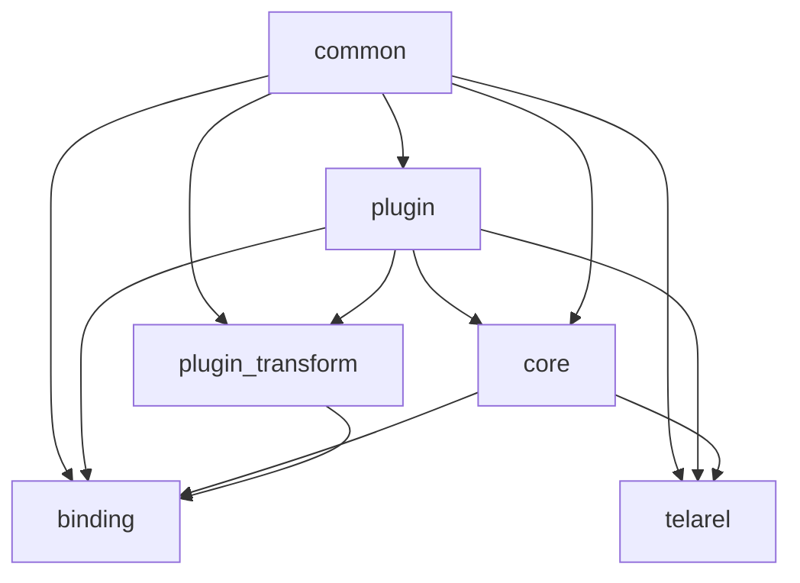
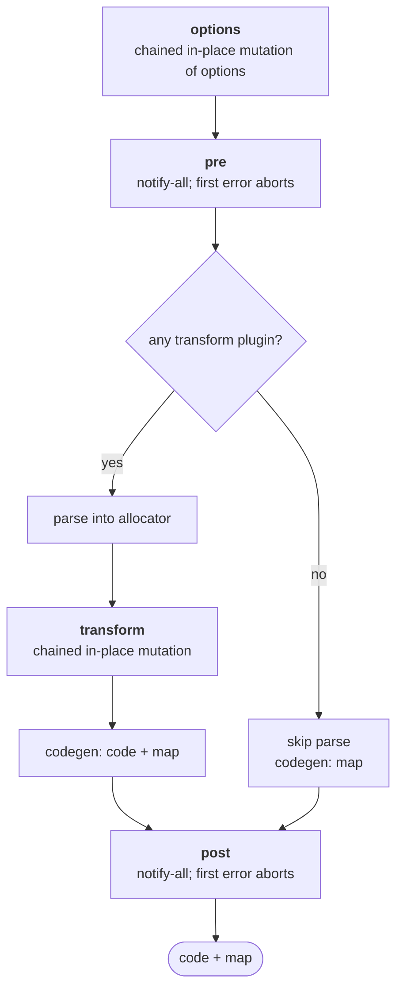
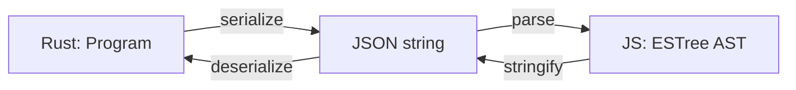
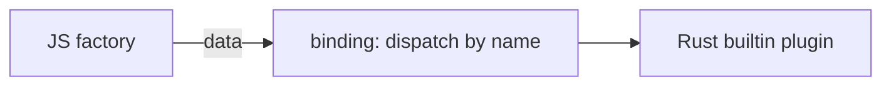

# Architecture

This is a architecture documentation of the compiler.

## Overview

Telarel is an extensible JavaScript compiler written in Rust, powered by [oxc](https://oxc.rs) and built around plugin hooks.

The [`compile`](./crates/core/src/lib.rs#L61) function takes compile options (`file`, `code`, and an optional `cwd` which defaults to the current working directory when omitted) plus a list of plugins, and returns a `CompileOutput` which generated code with a source map.

## Dependencies



`common` has no dependencies.

`binding` and `telarel` both depend on `common`, `plugin`, and `core`.

There are no cycles.

## Pipeline



The plugin implements 4 hooks (all with no operation by default). `options` goes without context since the context is built from the resolved options.

| Hook      | Context | Arguments                          | Return | Merge   |
| --------- | ------- | ---------------------------------- | ------ | ------- |
| options   | –       | options (mutable)                  | `()`   | chained |
| pre       | ✓       | file, code (read-only)             | `()`   | notify  |
| transform | ✓       | allocator, file, program (mutable) | `()`   | chained |
| post      | ✓       | file, final code                   | `()`   | notify  |

Merge semantics:

- **Chained** — each plugin mutates the same argument in place; mutations are visible to following plugins
    - `options` — mutable [`CompileOptions`](./crates/common/src/_types/options/compile.rs#L3) bag
    - `transform` — mutable [`Program`](./crates/plugin/src/_types/hooks/transform.rs#L6)
- **Notify** — `pre` and `post` run for side effects in registration order; the first error aborts

For `options`, the [driver](./crates/plugin/src/plugin_driver/hooks/options.rs) loops with `&mut` over one options bag.

For `transform`, a plugin may swap the entire root by assigning `*args.program` with a tree allocated in the shared allocator — pointer stability is the [driver's](./crates/plugin/src/plugin_driver/hooks/transform.rs) job.

### Hook Usage Declaration

[`register_hook_usage`](./crates/plugin/src/plugin/mod.rs#L22) is required and affects how the driver runs plugins. If a hook isn't declared, it won't be called.

On the JS side, usage is inferred from the hook properties on the plugin object. Therefore, even if `transform` never mutates the program, it still triggers parse + codegen.

### Parse Skip

The driver's aggregate [`HookUsage`](./crates/common/src/_types/hooks/usage.rs#L6) determines whether the source needs to be parsed. If no plugin declares `Transform`, parsing and codegen are skipped entirely. In that case, even invalid syntax is passed through, a [per-line identity map](./crates/core/src/lib.rs#L31) is returned instead of producing a parse error.

Declaring only `pre` or `post` does not trigger parsing.

## JS Plugin Bridge

The [binding](./crates/binding/src/plugin/pluginable.rs#L37) wraps JS plugin objects in `Pluginable` implementations that call JS through thread-safe function calls (TSFNs). The AST crosses the boundary as a JSON-serialized ESTree string via `oxc_estree_codec`:



The JS `options` hook receives the current `{ cwd, file, code }` bag and the wrapper always sends the full record back to Rust, so unmutated fields keep their values.

The JS `transform` hook is mutation-based: the wrapper parses the serialized tree, calls the hook, re-stringifies the tree, and compares it with the pre-call string. Equal — nothing crosses back into Rust; different — the JSON is parsed back into the compile allocator and swapped in as the root.

A shared `metadata` object is created for each compile and released in `Task::finally`, so it remains isolated between different compiles.

## Builtin Plugin Bridge

A builtin plugin is activated from JS as a plain data descriptor and executes in Rust.

```ts
{
    __builtin: true,
    name: "",
    options: {},
}
```

The descriptor crosses the bridge as data, and the binding dispatches it to the matching Rust builtin by name.



The [binding](./crates/binding/src/plugin/build.rs) routes a plugin to its Rust builtin only when the object carries the explicit `__builtin: true` property — no name prefix is reserved, so a user JS plugin may use any name.

Each builtin's name is defined once in its plugin crate and mirrored by the binding's napi enum.

## Execution Model

The transform hook's future is intentionally non-`Send` (`LocalHookFuture`) because programs borrow from the compile allocator. On native, each `compile` call runs on a libuv worker thread and `block_on`s a per-thread, reused current-thread Tokio runtime ([`block_on_compile`](./crates/binding/src/tasks/mod.rs), used by [`CompileTask`](./crates/binding/src/tasks/compile.rs#L10)). The non-`Send` transform future never escapes the worker thread: it is fully driven and dropped inside `block_on`.

The same TSFN-based binding also works with `wasm32-wasip1-threads`, and the JS test suite runs against both backends.

For traversal, plugin authors choose by task:

| Task                        | Rust                                          | JS                                           |
| --------------------------- | --------------------------------------------- | -------------------------------------------- |
| Simple field edits          | `telarel::ast_visit::{VisitMut, walk_mut}`    | mutate `args.ast`, or `telarel/walker`       |
| Parent/scope-aware rewrites | `telarel::traverse::{Traverse, traverse_mut}` | `walk` with `this.replace()` / `this.skip()` |

Details:

- **Simple field edits** — rename, retag, drop a node; JS `walk` is backed by `oxc-walker`
- **Parent/scope-aware rewrites** — insert after a node, or rename the binding a reference resolves to

For parent/scope-aware rewrites in Rust, enable the `traverse` feature; [`TraverseCtx`](./crates/telarel/src/lib.rs) provides parent/ancestor access and an `AstBuilder` for allocating nodes, with scoping built per compile via `SemanticBuilder::new().build(program).semantic.into_scoping()`. In JS, add a scope tracker only if the transform does not replace nodes.
