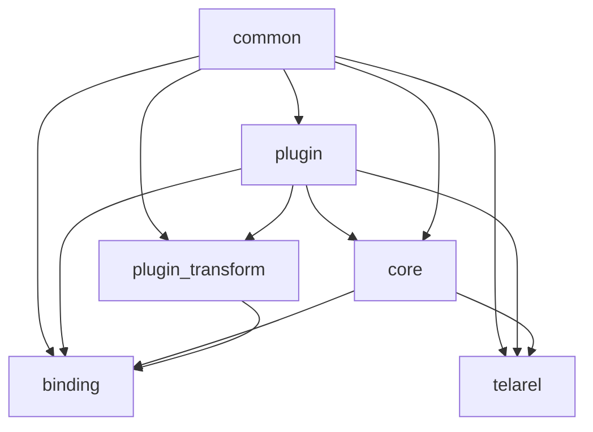
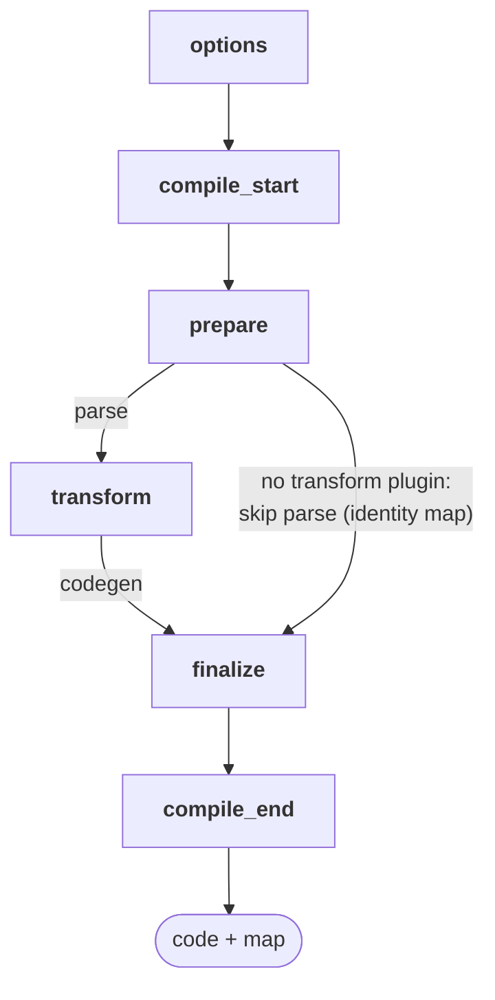
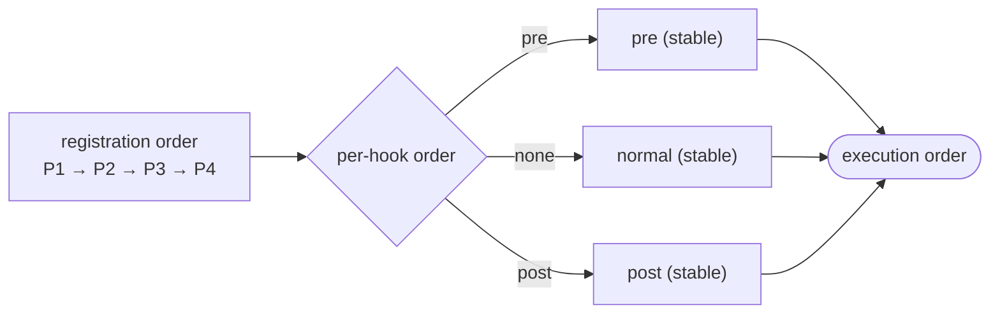
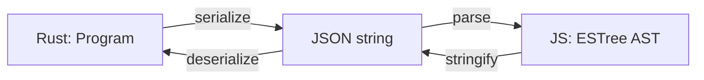
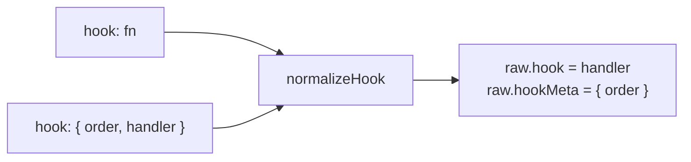
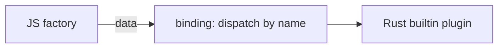

# Architecture

This is a architecture documentation of the compiler.

## Overview

Telarel is an extensible JavaScript compiler written in Rust, powered by [oxc](https://oxc.rs) and built around plugin hooks.

The [`compile`](./crates/core/src/lib.rs#L326) function takes compile options (`cwd`, `file`, `code` etc) plus a list of plugins, and returns a `CompileOutput` which generated code with a source map.

## Dependencies



`common` has no dependencies.

`binding` and `telarel` both depend on `common`, `plugin`, and `core`.

There are no cycles.

## Pipeline



The plugin implements different hooks (all with no operation by default). Every hook is return-based: the core owns all state and applies the returned value. Normal hooks (`options`, `prepare`, `transform`, `finalize`) return the new value (`Some` replaces, `None` keep the current one); notify hooks (`compile_start`, `compile_end`) ignore the returned value.

Hooks receive a context: `options` gets the [`CommonPluginContext`](./crates/plugin/src/_types/context.rs#L5), while later hooks get the flat [`PluginContext`](./crates/plugin/src/_types/context.rs#L22) with `cwd` and `module` info.

| Hook          | Arguments        | Return    | Semantics        |
| ------------- | ---------------- | --------- | ---------------- |
| options       | options          | options   | Fixpoint replace |
| compile_start | resolved options | ()        | Notify           |
| prepare       | code             | code, map | Carried fold     |
| transform     | ast              | ast       | Carried fold     |
| finalize      | code             | code, map | Carried fold     |
| compile_end   | code, map, err?  | ()        | Notify           |

Semantics:

- **Fixpoint replace** — `options` returns a whole [`OptionsArgs`](./crates/plugin/src/_types/hooks/options.rs#L10) to replace the current one
- **Notify** — `compile_start` and `compile_end` ignore the return value
- **Carried fold** — `prepare`, `transform`, and `finalize` carry a value from plugin to plugin

Ordering is per-hook: a plugin may be `pre` for one hook and `post` for another.

**Fixpoint replace** is struct-level replacement, not a patch: fields the returned `OptionsArgs` omits are dropped, and `None` keeps the current args. Returned `plugins` may inject new plugins, whose own `options` hooks then run — a fixpoint over the list (see [`crates/plugin/src/options/fixpoint.rs`](./crates/plugin/src/options/fixpoint.rs#L26)).

**Notify** hooks run in meta-ranked order (registration order within a bucket); `compile_end` runs on every path after the `options` fixpoint settles, including errors, but is not run when the `options` stage itself fails.

**Carried fold** replaces the carried value on `Some(output)` and keeps it on `None`; for `transform` the driver carries an owned, self-referential [`Ast`](./crates/common/src/ast/ast.rs) and reports the **last** `Some` (a later `None` cannot change it — see [`crates/plugin/src/plugin_driver/hooks/transform.rs`](./crates/plugin/src/plugin_driver/hooks/transform.rs#L27)). The chain starts from a borrow of the parsed AST and only takes ownership once a plugin returns `Some`, so the common "nothing changed" case never clones.

### Hook Usage Declaration

[`register_hook_usage`](./crates/plugin/src/plugin/mod.rs#L35) is required and affects how the driver runs plugins. It only gates `prepare`, `transform`, and `finalize`: if one of these isn't declared, it won't be called. `options`, `compile_start`, and `compile_end` run on every settled plugin regardless of declared usage.

On the JS side, usage is inferred from the hook properties on the plugin object. Therefore, even if `transform` never mutates the program, it still triggers parse + codegen.

### Per-hook ordering

Every hook carries its own optional `order` ([`PluginOrder`](./crates/plugin/src/_types/order.rs#L4) = `Pre | Post`). It is per hook, so one plugin can be `pre` for `prepare` and `post` for `transform`; each Rust hook exposes a `<hook>_meta()` returning `Option<PluginHookMeta>`, all defaulting to `None`.



| Order | Runs                              |
| ----- | --------------------------------- |
| Pre   | before every normal plugin        |
| None  | normal bucket, registration order |
| Post  | after every normal plugin         |

Buckets are stable, ranked by [`sort_plugins_by_hook_meta`](./crates/plugin/src/plugin_driver/mod.rs#L19). `compile_start` / `compile_end` also use their meta but run on every plugin; the [`options` fixpoint](./crates/plugin/src/options/fixpoint.rs#L29) re-ranks a fresh copy each pass, so a late-added plugin is ranked once it joins.

A Rust plugin overrides the hook's meta:

```rust
impl Plugin for MyPlugin {
    fn name(&self) -> Cow<'static, str> {
        "my-plugin".into()
    }

    fn register_hook_usage(&self) -> HookUsage {
        HookUsage::Transform
    }

    fn transform<'a>(
        &'a self,
        ctx: &'a PluginContext<'_>,
        args: TransformArgs<'a>,
    ) -> impl Future<Output = TransformReturn> + Send + 'a {
        async move { Ok(None) }
    }

    fn transform_meta(&self) -> Option<PluginHookMeta> {
        Some(PluginHookMeta { order: Some(PluginOrder::Pre) })
    }
}
```

### Parse Skip

The driver's aggregate [`HookUsage`](./crates/common/src/_types/hooks/usage.rs#L8) determines whether the source needs to be parsed. If no plugin declares `Transform`, parsing and codegen are skipped entirely. In that case, even invalid syntax is passed through, a [per-line identity map](./crates/core/src/lib.rs#L44) is returned instead of producing a parse error.

Declaring only `prepare` or `finalize` does not trigger parsing.

## JS Plugin Bridge

The [binding](./crates/binding/src/plugin/pluginable.rs#L341) wraps JS plugin objects in `Pluginable` implementations that call JS through thread-safe function calls (TSFNs). The AST crosses the boundary as a JSON-serialized ESTree string via `oxc_estree_codec`:



The JS `options` hook receives the bag and the wrapper maps each user hook's return value to the raw output shape the binding expects; the binding unmarshals it back into the pipeline types.

The JS `transform` hook send the returned AST as `astJson`. The binding keeps an equality short-circuit (`ast_json` unchanged -> `None`) as defense in depth for raw/unwrapped plugins.

Every `Plugin` hook is an [`ObjectHook<T>`](./packages/telarel/src/@types/plugin/index.ts#L26), i.e. `T | { order?: "pre" | "post"; handler: T }`. The [wrapper](./packages/telarel/src/bridges/normalize-hook.ts#L23) splits it into a handler plus a `<hook>Meta` sibling read by the binding.



A JavaScript plugin overrides the hook's meta:

```ts
const plugin: Plugin = {
    name: "my-plugin",
    transform: {
        order: "pre",
        handler: () => {},
    },
};
```

## Builtin Plugin Bridge

A builtin plugin is activated from JS as a plain data descriptor and executes in Rust.

```ts
{
    __builtin: true,
    name: "",
    options: {},
}
```

The descriptor crosses the bridge as data, and the binding dispatches it to the matching Rust builtin by name.



The [binding](./crates/binding/src/plugin/build.rs) routes a plugin to its Rust builtin only when the object carries the explicit `__builtin: true` property — no name prefix is reserved, so a user JS plugin may use any name.

## Execution Model

Every hook future is `Send` (`HookFuture`); the transform future crosses threads carrying only a read-only `&Ast`, because the AST is an owned value that bundles its own arena. On native, each `compile` call runs on a libuv worker thread and `block_on`s a per-thread, reused current-thread Tokio runtime ([`block_on_compile`](./crates/binding/src/tasks/mod.rs), used by [`CompileTask`](./crates/binding/src/tasks/compile.rs#L12)).

The same TSFN-based binding also works with `wasm32-wasip1-threads`, and the JS test suite runs against both backends.

For traversal, plugin authors choose by task:

| Task                        | Rust                                          | JS                                           |
| --------------------------- | --------------------------------------------- | -------------------------------------------- |
| Simple field edits          | `telarel::ast_visit::{VisitMut, walk_mut}`    | mutate `args.ast`, or `telarel/walker`       |
| Parent/scope-aware rewrites | `telarel::traverse::{Traverse, traverse_mut}` | `walk` with `this.replace()` / `this.skip()` |

Details:

- **Simple field edits** — rename, retag, drop a node; JS `walk` is backed by `oxc-walker`
- **Parent/scope-aware rewrites** — insert after a node, or rename the binding a reference resolves to

A Rust transform owns its output: `args.ast` is read-only, so a plugin that changes the tree calls `args.ast.clone()`, mutates the clone inside [`Ast::with_mut`](./crates/common/src/ast/ast.rs#L99) (which lends the arena and `&mut Program`), and returns `Ok(Some(TransformOutput { ast }))`. Returning `Ok(None)` leaves the carried AST untouched.

For parent/scope-aware rewrites in Rust, enable the `traverse` feature; [`TraverseCtx`](./crates/telarel/src/lib.rs) provides parent/ancestor access and an `AstBuilder` for allocating nodes, with scoping built per compile via `SemanticBuilder::new().build(program).semantic.into_scoping()`. In JS, add a scope tracker only if the transform does not replace nodes.
